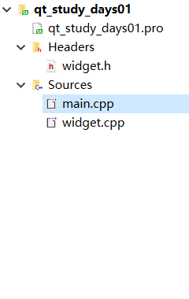
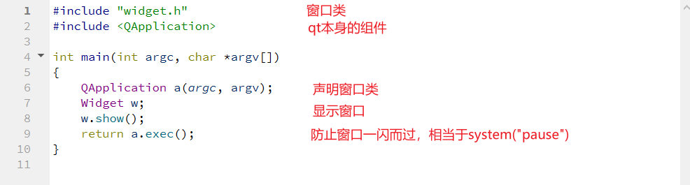
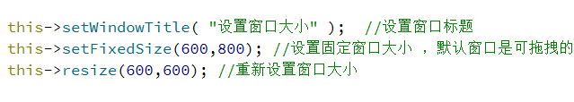
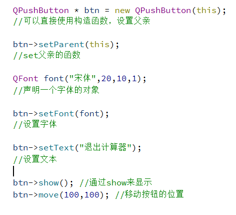

# 界面介绍

从上倒下依次是

1. project文件，相当于vs的sln
2. 窗口类头文件（剩下的两个都是他的派生）
3. mian.cpp 程序入口
4. widget.cpp 窗口源文件

常用快捷键：

F2 ：定义声明的切换

ctrl+/：注释

# 常用API介绍

1. ``setWindowTitle(Qstring& )``
2. ``setFixedsize(int w ,int h)``
3. ``resize(int w,int h)``

4. 字体类：``QFont``

   ``QFont font(Qstring& family , int size , int weight , int lean)``

   

## 创建按钮

头文件：``QPushButton``

类型名：``QPushButton``

设置父（即所在窗口）：``setParent(QWidght * parent)``

设置文本内容：``setText(Qstring& text)``

在父中显示：``show()``

设置字体：``setFont(QFont & font)``

位置移动：``move(int x , int y)`` 

​	qt 坐标是→和↓坐标系，原点是右上角

先显示还是先对按钮进行操作都对最终的显示效果没有影响

# 对象树

1. 处于对象树中的堆成员无需手动释放
2. 设置父可将对象放在对象树中
3. 实质是利用继承关系（继承自Qobject）实现析构的简化
4. 先释放子对象后释放父对象