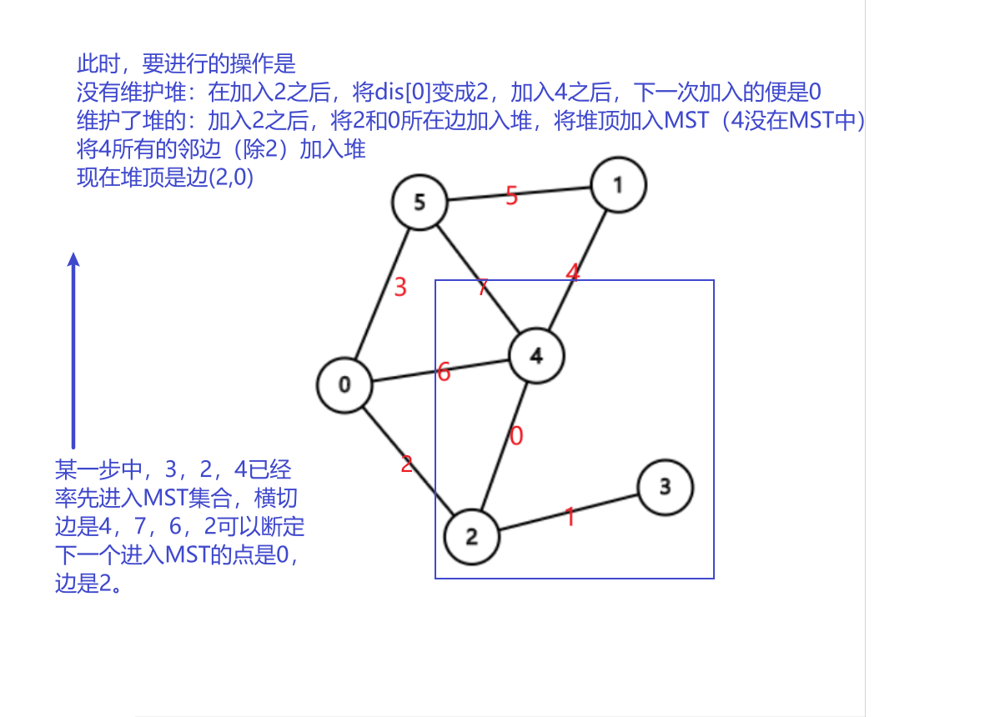

# 图的概念

## 图

- 图：由顶点$(vertex)$和把顶点连起来的边$(egde)$构成的数据结构

  表示：$graph(G) = (V,E)$

  图的描述：使用点集和边集来描述

  如

$$
V = \{1,2,3,4 \}\\
E=\{(1,2),(1,3),(1,4),(3,4) \}
$$


- 子图$(subgraph)$：主图的一部分$G1 = (V1,E1),G2=(V2,E2) ,\quad \mbox{如果} V2\subseteq V1,E2\subseteq E1$ G2是G1的子图

- 简单图：没有重复边且顶点不连向本身的图，反之为复杂图

## 边

- 边的方向：
  - 有向：带箭头的线，箭头的一段是头，表示为<a,b>，$a\to b$ 。称为**弧**，图称有向图
  - 无向：没有箭头的线，表示为$(a,b)$，图称无向图

- 权值$(weight)$：边的长度,带权的图被称为网（网络）

## 顶点

- 度$(Degree)$ ：与某个节点相连的边的个数，记作$TD(V)$

  - 入度$ID(V)$：有向图中以某个顶点为终点的有向边的条数

  - 出度$OD(V)$：有向图中以某个顶点为起点的有向边的条数

- 邻接点$(Adjacent)$：

  - 无向图，相邻的点为邻接点，连结着两个顶点的边依附$(Incident)$于两个顶点，或者说边$(V1,V2)$和顶点$V1，V2$相关联

  - 对于有向图$<v_1,v_2>,v_1邻接到v_2,v_2邻接自v_1$

- 路径$(Path)$：从一个顶点到达另外一个顶点的方法

  - 使用顶点的序列来表示，两个相邻的顶点能够构成邻接关系

    如$1,2,3$表示从$1\rightarrow3$的路径

  - 路径的长度：路径上边或者弧的数目

  - 简单路径：经过的顶点不重复

- 回路（环）$(Cycle)$：

  起点和终点相同的路径

  简单环：除终点，其余的顶点在环上出现一次

- 连通：
  - **无向图中**，两个顶点间存在路径，称连通
    - 无向完全图有$\frac{n\times(n-1)}{2}$条边，有向完全图有$n(n-1)$条边
    - 稠密图：一个边数接近完全图的图边数$n*logn$，稀疏图：一个边数远小于完全图的图
  - 连通图（完全图）：顶点都连通的图，非连通图由若干连通分量构成
    - 强连通分量：最大的连通子图
    - 强连通图：有向图中任意两点都能相互到达

## 图和树

如果图连通且无回路则称为树

几种等价的表述

1. n-1条边的连通图
2. 连通的五环图

有向树：**有向图**，恰有一个顶点入度为0（有向根），其他顶点入度为1

## 练习

1. 将n个顶点的无向图连接称为一个连通图最少要几条边：n - 1条，连成一条线
2. 将n个顶点的有向图连接称为一个连通图最少要几条边：n条，连成环

# 图的储存

## 邻接矩阵

```c++
int n;  //顶点的个数
int k; //边的条数
vector<vector<int>> g(100, vector<int>(100, INT_MAX)); //用二维数组来表示两个点之间的关系
//C风格: int G[n][n];
```

- 无权图：1表示连通，0表示不连通 $G[i][j] = 1/0$

  有权图：$G[i][j] = weight/INF$

- 对角线为$0/INF$，没有自己到自己的边

- 无向图的邻接矩阵是对称矩阵

构建

```c++
for( int i = 0 ; i < k ; i++ ){ //这里k表示要输入的边数。
    int from , to , w ;
    cin >> from >> to >> w;   //from / to / weight
    g[ from ][ to ] = w;
    g[ from ][ to ] = w;  //无向图
    //无向图有对称性
}
```

## 邻接表

```c++
int n;
int k;
struct arc_node {
	int weight;
	int to;
	arc_node(int t, int w) :to(t), weight(w) {}
};
vector<vector<arc_node>> graph(n);  //使用 vector 来表示顶点 i 的邻接边
//C风格: vector<arc_node> g[n];
```

- 判断两点之间的关系：
- 邻接表中的边一定是有向的，所以叫$arc$

构建

```c++
for (int i = 0; i < k; ++i) {
	int from, to, w;
	cin >> from >> to >> w;  //指weight
	g[from].push_back(arc_node(to, weight));
    g[to].push_back(arc_node(from, weight));
}
```

- 第一重的下标是起点为from的下标，第二重的下标没有意义，因为边实际上是没有顺序的

## 边集数组

```c++
struct edge {
	int weight;
	int to;
	int from;
	edge(int f, int t, int w) :from(f), to(t), weight(w) {}
};
```

# 图的定义

```c++
class Graph {
public:
    //无参构造
	Graph() : n(0), k(0) { memset(vis, 0, 100); }
	//有参构造
    Graph(int _n, int _k, edge * edges) : n(_n) , k(_k) {
		memset(vis, 0, 100);
		vector<vector<arc_node>>(_n).swap(g);
		for (int i = 0; i < k; ++i) {
			g[edges[i].from].push_back(arc_node(edges[i].to, edges[i].weight));
			g[edges[i].to].push_back(arc_node(edges[i].from, edges[i].weight));
		}
	}

	void DFS();

	void BFS();

	void prim();
private:

	void dfs(int i);

	void bfs(int start);

	//数据
	vector<vector<arc_node>> g;
	int k;
	int n;
	bool vis[100];

};
```


# 图的遍历

## 深度优先遍历(DFS  Deep-First-Search)

先顺着每一条路向下找，找到底之后回溯一步向前一个节点的另一个分支继续向下找

```c++
void dfs(int i) {
	//这里没递归边界了，写在for循环中
	cout << i << endl;
	vis[i] = true;

	for (auto j : g[i])
		if (!vis[j.to]) {
			vis[j.to] = true;
			dfs(j.to);
		}
}
void DFS() {
	for (int i = 0; i < n; ++i)
		if (!vis[i])  //遍历所有节点，还是为了避免不连通
			dfs(i);
}


//这里不需要回溯，当一个状态会影响另一个状态的判断时，需要恢复到这个还没有到过这个点的状态
//dfs剪枝
//当一些分支从一开始就错了的时候，我们不需要再从错的地方向下走
```

DFS生成树：按照DFS的遍历顺序，生成一颗树，非连通子树之间，不能通过一颗DFS生成树产生联系


## 广度优先遍历( BFS Breadth-First-Search)

```c++
void bfs(int start) {  //单独对每一个节点进行广度优先搜索

	queue<int> que;  //队列
	que.push(start);
	while (!que.empty()) {

		int from = que.front();  //遍历这个点
		cout << from << " ";

		vis[que.front()] = true;  //标记
		que.pop();//出队

		for (auto i : g[from])  //将连接的节点加入queue
			if (!vis[i.to]) {
				vis[i.to] = true;
				que.push(i.to);
			}
	}
}

void BFS() {  //避免顶点之间不连通的情况
	for (int i = 0 ; i < n ; ++i)
		if (!vis[i])
			bfs(i);
}

```

# 回路问题

## 欧拉路

- 欧拉路：路径上点可以重复，边不能重复，又叫一笔画

- 奇点：跟一个点相连的边的条数为奇数

欧拉路存在的条件：图是连通的，有且只有2个奇点

欧拉回路存在的条件：图是连通的，有0个奇点

```c++
void dfs(int i ,int deep){
    path[deep] = i;
    if(deep == M+1) return;
    for(int j = 0; j < G[i].size(); ++j){
        	int temp = G[i][j];
        	G[i].erase(temp);  //在顶点i的邻接点中删去temp点
        	G[temp].erase(i);  //在temp点的邻接点中删去j
            dfs(temp,deep+1);  //深搜temp点
  			G[i].push_back(temp);  //回溯
        	G[temp].push_back(i);  //回溯
    }
}
```


## 哈密尔顿环

哈密尔顿环：回路上的点和边都不能重复

```c++
void dfs(int x, int deep ) {  //本顶点,递归深度
	if (deep == n + 1)
		for (auto i : G[x])
			if (i == path[0]) {
				path.push_back(i);
				return;
			}
	for (auto i : G[x]) 
		if (!vis[i]) {
			
			vis[i] = true;
			path.push_back(i);
			
			dfs(i, deep + 1);
			
			//回溯
			path.pop_back();
			vis[i] = false;
		}
}
//几个特点，不能回头，可以通过标记点来实现
//哈密尔顿路径上的点可以重复，当且仅当这个点是起点也是终点并且不是回头
```

# 最小生成树(Minimum Spanning Tree)

- 什么是最小生成树？

  用 N-1 条边连接 n 个顶点，形成树。

  一个具有N个点的有权无向图，最小生成树是从图的所有边中选择N-1条出来，链接所有的N个点，这N-1条边的边权之和是所有方案中最小的

- 用来解决什么问题

  如何用最小的代价链接N个点的问题

  如要修建若干条高速公路把N个城市联系起来，问如何设计使得工程造价最小

## 克鲁斯卡尔(Kruskal)算法

巧妙利用并查集

1. Kruskal 首先初始化并查集，把N个点看做N个独立的集合，再将所有的边从小到大排序
2. 按顺序枚每一条边，如果这条边链接的两个点属于两个集合，那么就把这条边加入最小生成树，并且合并这两个集合；如果这条边链接的两个点属于同一个集合就跳过，直到选取了N-1条边为止

```c++
int k = 0; //记录边数
int ver; //记录顶点个数
int MST = 0; //记录边的权值之和
struct E {//边
    int u;  //起
    int v;  //终
    int w;  //权
} E[100];
cin >> N >> M; //输入顶点和边的总个数 
for(int i = 0 ; i < k  ; ++i)   //这里难道不是M
    cin>>E[i].u>>E[i].v>>E[i].w;
for(int i = 0 ; i < N ; ++ i){ //输入顶点值并且初始化集合
    int x;
    cin>>x;
    parent[x] = x;
}
//按边的权值从小到大进行排序

//排序不写！！
//
//
for(int i = 0 ; i < M ; ++i){
    if(find(E[i].u) != find(E[i].v)){
        union(E[i].u,E[i].v);
        MST+=E[i].w;
        ++k;
    }
    if( N - 1 == k ) break;
}
//时间复杂度ElogE
```

## 普里姆(Prim)算法

贪心

- 需要准备的数据

  - 这个点是否已经进入MST集合的标记vis

  - 一个邻接表

  - 某个没有进入集合的点，距离集合的最小距离dis，

- 具体做法

  - 任选一点进入MST集合

  - 让距离集合最近的点进入MST集合

  - 更新集合外的某个点到集合的距离，实际上只有新加入的点的邻接点有可能获得更新

- 使用切分的理论来解释

  - 选择一个点加入MST集合
  - 切断某些边，将n个点分成MST集合和另一个集合，横切边中权值最小的那一条加入最小生成树
  - 将被切断的边的另一端顶点加入MST，重复上一步

- 时间复杂度分析

  - 没使用堆：$O(v^2)$

  - 使用堆：$O(v\times logv)$

- 图解

  

- 堆

  ```c++
  void prim_heap() {
  		priority_queue<arc_node> heap;  //重载小于号是大于
  		int MST = 0;
  		for (auto i : g) {
  			int mark = 0;  //标记
  			while (!heap.empty() && vis[heap.top().to] == true)  //删去终点已经在MST集合中的弧，剩下的，就是短的
  				heap.pop();
  			if (!heap.empty()) {  //将最短加入MST
                  mark = heap.top();  //节点标记
  				MST += heap.top().weight; //边权加入
                  heap.pop();  //弹出
  			}
  
  			vis[mark] = true;  //将最短弧的终点加入MST
  
  			for (auto j : g[mark])
                  if(!vis[j.to])
  					heap.push(j);
  		}
  		memset(vis, 0, 100);
  	}
  ```

- 无堆

  ```c++
  void prim() {
  
  	int dis[100]; //用数组储存n个点到集合中某个点的最小权值，默认为INF
  	memset(dis, 100, 100);
  	int MST = 0;
  
  	for (auto i : g) {
  		//先找MIN中最小值
  		int mark = 0;
  		//dis[0]永远很大	
  		for (int j = 0; j < n; ++j)  //找到集合的最小距离的点
  			if (!vis[j])
  				mark = dis[mark] > dis[j] ? j : mark;
  			
  		if(mark != 0)  //最开始将0放入时，不增加权值
  			MST += dis[mark];
  		
  		vis[mark] = true;  //将这个点加入到集合中
  
  		for (auto j : g[mark])  //看看集合外的点到集合的距离能不能更短
  			if (!vis[j.to])
  				dis[j.to] = min(dis[j.to],j.weight);
  	}
  }
  ```

  

# 最短路

## 无权最短路广搜

一个无权图，给定一个起点和一个终点，求从起点到终点的最短步数

分析：使用广搜，谁先搜到谁最短

```c++
const int max = (int)1e4;
queue<int> q;  //队列
int vector<int> G[max]; //邻接表
int pre[max];  //前驱
void bfs(int start,int end){  //传入起点，终点
    q.push(start);
    while(!q.empty()){
        int s = q.top();
        q.pop();//队头出队
		for(auto i : G[s]){
			if(!vis[i]){  //如果没被看过
                q.push(i);
                D[i] = D[s] + 1; //记录路径
                pre[i] = s;  //记录前驱
            }
        }
    }
    return D[end];
}
```

## 弗洛伊德(Floyd)算法

有权图：边带有权值的图

边权：两点之间的距离

最短路径：从源点到终点的所有路径中，边权之和最小的那一条路径

多源最短路径问题：求任意两顶点之间的最短路径

```c++
int floyd(int s,int f){
    for(int k = 0 ; k < M ; ++k)
        for(int i = 0 ; i < M ; ++i)
            for(int j = 0 ; j < M ; ++j)
                D[i][j] = min(D[i][j],D[i][k] + D[k][j]);
}
//D[i][j]记录从i到j的路径长度，不能到达为无穷，对角线为0
```

动态规划

需要证明当计算D\[i][j] 的最小值时，D\[i][k]和D\[k][j]都取得了最小

证明后续添加

## 迪杰斯特拉(Dijkstra)算法

```c++
int D[max]; //表示某点到源点的最短路，初始化D[0] = 0;
int Pre[max]; //表示前驱数组,初始化pre[0]为0;其他无所谓
bool B[max]; //蓝白点标记,初始化为0
int w[max][max]; //矩阵，到自己为0，没有边为INF，有边存权
for(int i = 0 ; i < M ; ++i){
        int min = INF;
        int k = 0;
    //初始化该点到原点的最小值
    //初始化该点
    for(int j = 0 ; j < M ; ++j)
        if(!B[j] && D[j] < min){
            k = j;
            min = D[j];
        }
    //选取到源点距离最小的点
    B[k] = 1; //染色
    for(int j = 0 ; j < M ;++j)
    	if(!B[j] && D[k] + W[k][j] < D[j]){
            D[j] = D[k] + W[k][j];
        	Pre[j] = k;
        }
    //更新这个点相邻的点到源点的距离        
}
```

## 福特(Ford)算法

遍历边

```c++
struct edge{
    int u;
    int v;
    int w;
} edges[max]; //边集数组
D[max]; //某点到源点的距离 
for(int i = 1 ; i < N ; ++i){ //遍历n-1次
	for(int j = 0 ; j < M ; ++j){ //遍历所有边
        int u = edges[j].u;
        int v = edges[j].v;
        int w = edges[j].w;
        if(D[v] + w < D[u] ){
            D[u] = D[v] + w;
            Pre[u] = v;
        }
        if(D[u] + w < D[v]){
            D[v] = D[u] + w;
            Pre[v] = u;
		}
    }
}
```

## SPFA算法

```c++
D[max]; //某点距离源点的最远距离
vector<edge> G[max];
int W[max][max];
int exist[max];
queue<int> q; //队列

void ford(int s)
{
    q.push(s);
    while(!q.empty())
    {
        int tmp = q.front();
		q.pop();
        exsit[i] = false;
        for(int i : G[tmp])
			if(D[tmp] + W[tmp][i] < D[i])
            {
                D[i] = W[tmp][i] + D[tmp];
                pre[i] = tmp;
                if(!exist[i])
                {
                    q.push(i);
                    exist[i] = true;
                }
            }
    }
}

```

# 拓扑排序和AOV网

# 强连通分量

# 并查集(Union Find)

- 用来解决两个元素之间有没有联系的数据结构
- 是用数组来实现的树状结构

1. 查找代表元素

   ```c++
   int find(int x)
   {
       if(parent[x] == x)  //如果父亲是自己，直接返回自己
           return x;
       return find(parent[x]); //其他情况查找父亲的父亲
   }
   ```

2. 求并集

   ```c++
   void union(int x ,int y)
   {
       int x1 = find(x);
       int y1 = find(y);
       //找到x，y的祖先，并将y的父亲指向x
       parent[y1] = x1;
   }
   ```

3. 路径压缩

   在查找的过程中将递归层数缩短

   ```c++
   int find(int x){
       if(parent[x] != x)  
           parent[x] = find(parent[x]);
       return  parent[x]; 
   }
   ```

4. 按秩合并

   秩：指一棵树的层数

   ```c++
   void union(int x,int y){
       int x1 = find(x);
       int y1 = find(y);
       if(Rank[x1])>Rank[y1])
           parent[y1] = x1;
       else{
           parent[x1] = y1;
           if(Rank[x1]==Rank[y1])
               Rank[x1]++;
       }
   }
   ```
