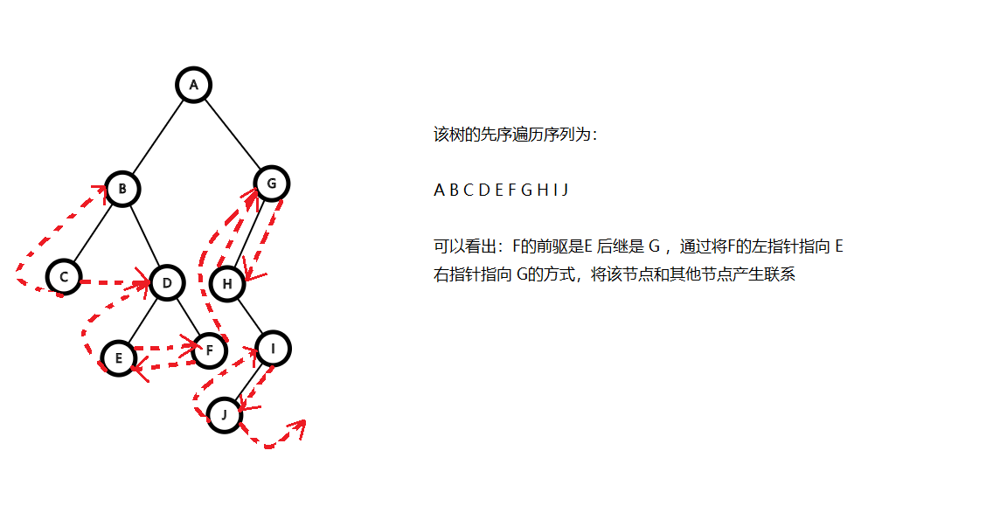
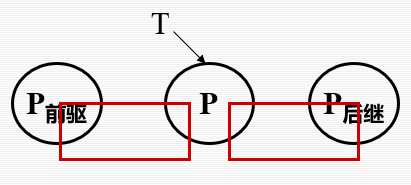

#  树的定义
## 定义
1. 树是由n（n>=0）个元素组成的有限集合（**set**），n=0 时称为空树。
2. 每个元素称为结点（node）（不是节点！）
3. 每一棵树都有一个特定的结点称为根结点或者树根（**root**）（树根只有一个）
4. n>1时，除根结点之外的**每个**结点（这个结点是子树的根）能分为m（m>=0）个**互不相交**的有限集合，每一个集合又是一棵树，称为根的子树（**SubTree**）
5. 一棵树由树根和他的子树组成。
## 树的基本概念
1. 树是递归定义的，即在树的定义过程中又用到了树这个概念
2. 结点（node）
   1. 一棵树（非空树）**至少有一个结点**，这个结点是根结点，他没有前驱（不是所有的根结点都没有前驱），其余所有结点都有唯一的前驱。
   2. 树的结点（这个节点是这棵树的根）包括唯一的数据元素，和若干指向其子树的分支。
   3. 结点拥有子树的个数称为结点的度（**degree**），度为0的结点称为**叶节点(leaf)**，度不为0的结点称为**分支结点**或者**非终结点**，根以外的分支节点称为**内部节点**，树中各节点的度的最大值称为这棵树的度。树的***入度=出度***
   4. 两个节点由一条线段链接（这条线段称为树枝），上端结点是下端结点的**父结点**或者**双亲结点(parents)**，下端节点是上端结点的子结点（**child**），同一个父节点的多个子结点互为兄弟结点（**sibling**）。
   5. 从根结点到某个子结点所经过的所有节点称为该结点的祖先
   6. 称以某个节点为根的子树中的任意结点都是该结点的子孙。
3. 层次（level）
   1. 一棵树根节点的层次，为**1**，子节点的层次为其父节点的层次+1。
   2. 层次最大值为该树的**深度(height)**。
4. 路径
   1. 树中任意两个不同的结点，如果从一个结点出发沿着树枝能够到达另一个结点，称它们之间存在着一条路径。
   2. 路径用所经过的结点序列表示。
   3. 路径的长度等于路径上的结点个数 - 1.
   4. 不同子树的结点之间不存在路径
   5. 一定能找到一条路径，使根节点能够到达子节点。
5. 森林 (forest)： 指互**不相交**树的并集。

## 树的表示

1. 图形表示法，类似图
2. 嵌套集合表示，如其名
3. 凹入表表示法：类似一本书的目录
4. 广义表表示法：如(A,( B,(C),(D),(E) ), ( F,(G),(H) ) )

# 树的遍历

1. 前序遍历

   先遍历结点后遍历左树然后遍历右树。

2. 中序遍历

   先遍历左树然后遍历结点然后遍历右树

3. 后序遍历

   先遍历先左树后右树然后结点
   
4. 层序遍历

   如题  

   ```c++
   using namespace std;
   //用队列，相当于广搜
   void level_order(Tree_node<char>* root)
   {
       vector<char> res;
       std::queue<Tree_node<char>*> que;
       que.push(root->lc);
       que.push(root->rc);
       while (!que.empty())
       {
           
           //注意这两句是单独的if
           if (que.front()->lc != nullptr)
               que.push(que.front()->lc);
           if (que.front()->rc != nullptr)
               que.push(que.front()->rc);
   
           if (!que.front()) res.push_back('#');
           else res.push_back(que.front()->val);
   
           que.pop();
       }
   }
   ```

# 二叉树(binary tree)

## 定义

n个结点的有限**集合**，n = 0，为**空树**(注意树的定义没有空树，虽然这很无聊但也是考点)，显然该集合是空集，n>0时，分成一个结点和两个集合，结点是这棵树的根节点，两个集合有分别构成这棵树的两个子树。

- 每个节点都有左右子树，但是子树可能是空树（数学上，是**空集**），左右不是对称的

  例如由三个结点构成的所有树有**2个（树并不计较左右的对称性）**，二叉树有5个

  

  

  

  

  

## 二叉树的性质

1. 二叉树在第$i$层上的**最大**结点个数$2^{i-1}(i>=1)$个，空结点也算(感觉这里不如说成是槽位的个数)

2. 深度为k的二叉树的结点数<=$2^k-1$ （k>0）

   $\mbox{这里是等比数列求和},1+2+4+...+2^{k-1} = 2^k - 1$

3. 对于一棵非空的二叉树T，如果其叶节点(度为0的节点数)的个数为$n_0$，其度为2的结点的个数为$n_2$，那么$n_0 = n_2 + 1$

   **即：度为0的结点数 = 度为2的结点数 + 1**

   证明：一棵二叉树只有三种结点，度为0的结点$n_0$，度为1的结点$n_1$，度为2的结点$n_2$，那么，总结点$n=n_1+n_2+n_0$ ，又 ： 总结点数 - 1 = 总树枝数，而总树枝数 = $n_1+ 2*n_2$ 综上 $n_0 = n_2+1$

4. **满二叉树**：每层都有最大结点的二叉树（没有空子树）

5. **完全二叉树**：满二叉树最下层从**右向左连续**删除若干个结点的二叉树

6. 有n个结点的完全二叉树的深度$[\log_2^{\;n}] + 1$

7. 如果满二叉树或者完全二叉树按照**从上到下，从左到右**的顺序编号（从1开始），那么

   - 编号为i的结点的左子结点的编号为$2\cdot i$
   - 编号为i的结点的右子结点的编号为$2\cdot i  + 1$
   - 编号为i的结点的父结点的编号为$[i/2]$

## 二叉树的储存和建立

1. 完全二叉树

   可以使用一维数组来储存

   将完全二叉树从上往下，从左往右进行编号，放进一维数组中

   ```c++
   int full_binary_tree[max + 1];
   for(int i = 1 ; i <= max ; ++i)
       cin>>full_binary_tree[i];
   //取任意一个结点的左子节点
   	full_binary_tree[ 2 * i ];
   //右子节点
   	full_binary_tree[ 2 * i + 1 ];
   //父节点
   	full_binary_tree[ i / 2 ];
   //注意，这是下标从1开始
   ```

2. 二叉链表存二叉树

   ```c++
   template<class T>
   class Tree_node {
   public:
   	T val;
   	Tree_node* lc;  //lc : left child
   	Tree_node* rc;
   
   	Tree_node() :lc(nullptr), rc(nullptr), val(0) {};
   	Tree_node(T val) :lc(nullptr), rc(nullptr), val(val) {};
   
   };
   //依然是根据编号确定位置，不过，现在可以自由
   ```

3. 数组模拟链表储存二叉树

   ```c++
   struct BTnode{
       char data;
       int lc;
       int rc;
   } tree_nodes[max];
   //用for循环？
   ```

## 二叉树的遍历

1. 二叉树结点的定义

   ```c++
   template<class T>
   class Tree_node {
   public:
   	T val;
   	Tree_node* lc;  //lc : left child
   	Tree_node* rc;
   
   	Tree_node() :lc(nullptr), rc(nullptr), val(0) {};
   	Tree_node(T val) :lc(nullptr), rc(nullptr), val(val) {};
   
   };
   ```

2. 递归的遍历

   ```c++
   tempalte<typename T>	
   void preorder(Tree_node<T> *node ) {  //先序遍历，先遍历自己再遍历自己的左右子树
   		if (node) {
   			cout << node->val<<" ";
   			preorder(node->lc);
   			preorder(node->rc);
   		}
   		else {
   			cout << "null" << " ";
   		}
   	}
   
   template<typename T>
   void inorder(Tree_node<T>* node) {  //中序遍历，先遍历左子树再遍历右子树
   	if (node) {
   		inorder(node->lc);
   		cout << node->val << " ";
   		inorder(node->rc);
   	}
   	else {
   		cout << "null" << " ";
   	}
   }
   
   template<typename T>
   void postorder(Tree_node<T>* node) {  //后序遍历，先遍历左右子树再遍历自己
   	if (node) {
   		postorder(node->lc);
   		postorder(node->rc);
   		cout << node->val << " ";
   	}
   	else {
   		cout << "null" << " ";
   	}
   }
   ```

3. 非递归的遍历

   ```c++
   void preorder_iter(Tree_node<char>*& node) {  //先序遍历，先遍历自己，然后右节点压栈，左节点压栈，然后重复
   	stack< Tree_node<char>* > s;
   	s.push(node);
   	while (!s.empty()) {
   		if (s.top()!=nullptr) {
   			Tree_node<char>* temp = s.top();
   			s.pop();
   			cout << temp->val << " ";
   			s.push(temp->rc);
   			s.push(temp->lc);
   		}
   		else {
   			cout << "null" << " ";
   			s.pop();
   		}
   	}
   }
   void inorder_iter(Tree_node<char>*& node) {  //中序遍历，先将自己弹栈，然后右结点压栈，自己压栈，左节点压栈，遇到空的时候遍历本身和自己的父节点
   	stack< Tree_node<char>* > s;
   	s.push(node);
   	while (!s.empty()) {
   		if (s.top() != nullptr) {
   			Tree_node<char>* temp = s.top();
   			s.pop();
   			s.push(temp->rc);
   			s.push(temp);
   			s.push(temp->lc);
   		}
   		else {
   			cout << "null" << " ";
   			s.pop();
   			if (!s.empty()) {
   				cout << s.top()->val << " ";
   				s.pop();
   			}
   		}
   	}
   }
   void postorder_iter(Tree_node<char>*& node) {  //后序遍历直接写有些麻烦，可以根据后序遍历序列从后向前看是一个前序遍历序列交换左右子树的遍历顺序而得到的。
   	stack< Tree_node<char>* > s;
   	stack< Tree_node<char>* > res;
   	s.push(node);
   	while (!s.empty()) {
   		if (s.top() != nullptr) {
   			Tree_node<char>* temp = s.top();
   			s.pop();
   			res.push(temp);
   			s.push(temp->lc);
   			s.push(temp->rc);
   		}
   		else {
   			res.push(nullptr);
   			s.pop();
   		}
   	}
   	while(!res.empty()){
   		if (res.top()) {
   			cout << res.top()->val<<" ";
   		}else{
   				cout << "null" << " ";
   		}
   		res.pop();
   	}
   
   }
   ```

   

### 其他问题

- 根据中根遍历和后根遍历或者中根遍历和先根遍历的序列可以重建一棵树

  证明：

- 当左子树不存在时中序和后序遍历相同

  当右子树不存在时先序遍历和中序遍历相同

  上面两种情况下先序和后序遍历均相反

## 二叉树的重建

1. 层序遍历重建二叉树

   ```c++
   void create_tree(Tree_node<char>*& root,int * arr,int i,int len){  //注意这里传入的是指针的地址,注意根据二叉树中下标的关系来进行层序序列的重建二叉树
       if(arr[i]== 0|| i>=len){
           root = nullptr;
           return;
       }
       else{
           root = new BTnode;
           root->data = arr[i];
           create_tree(root->left,arr,2*i+1,len);
           create_tree(root->left,arr,2*i+2,len);
       }
   }
   ```

2. 扩展的前序序列建立二叉树

   ```c++
   template<typename T = char>
   void crt_re_pre(vector<T>& l, Tree_node<T>*& node) {
   	static int k = 0;
   	if (l[k] != '#') {
   		node = new Tree_node<T>(l[k]);
   		k++;
   		crt_re_pre(l, node->lc);
   		crt_re_pre(l, node->rc);
   	}
   	else {
   		node = nullptr;
   		k++;
   		return;
   	}
   }
   ```

3. 给定先序和中序确定二叉树

   ```c++
   class Solution {
   public:
       TreeNode* buildTree(vector<int>& preorder, vector<int>& inorder) {
           this->preorder = preorder;
           for(int i = 0; i < inorder.size(); i++)
               dic[inorder[i]] = i;   //建立索引确定该数值在中序中的位置
           return recur(0, 0, inorder.size() - 1);
       }
   private:
       vector<int> preorder;
       unordered_map<int, int> dic;
       TreeNode* recur(int root, int left, int right) { 
           if(left > right) return nullptr;                        // 递归终止
           TreeNode* node = new TreeNode(preorder[root]);          // 建立根节点
           int i = dic[preorder[root]];                            // 划分根节点、左子树、右子树
           //确定需要写入的元素的位置
           /*
           * 左子树
           * 这次的 下一个
           * 右子树这一次 + 左子树的大小
           //确定左子树的范围
           /*
           *这一次的左边界为下一次的左边界
           *下一次的有边界是中序中需要写入元素的位置 - 1 
           */
           //确定右子树的范围
           /*
           * 左：中序的下一个
           * 这一次的右
           */      
           node->left = recur(root + 1, left, i - 1);              // 开启左子树递归
           node->right = recur(root + i - left + 1, i + 1, right); // 开启右子树递归
           return node;                                            // 回溯返回根节点
       }
   };
   ```


## 前驱和后继

现在我们将一棵二叉树中序遍历下一个元素的前驱称为这个元素的前驱，它的后继称为这个元素的后继

1. 求前驱

   - 左子树存在：指针指向先向左树根节点，然后一直右下，直到右下是空
   - 左子树不存在：向父节点找，直到当前节点是其父节点的右节点

   ```c++
   //前驱
   template<class T>
   BST_node<T>* BST<T>::inpre(BST_node<T>* node) {
   	if (node == nullptr) return nullptr;
   	else {
   		BST_node<T>* p  = node->lc;
   		//左不是空
   		if (p != nullptr) {
   			while (p->rc != nullptr) {
   				p = node->rc;
   			}
   			return p;
   		}
   		//左是空
   		while (node->parent != nullptr && node == node->parent->lc) {
   			node = node->parent;
   		}
   		return node->parent;
   	}
   }
   ```

2. 求后继

   完全对称

   ```c++
   //后继
   template<class T>
   BST_node<T>* BST<T>::insub(BST_node<T>* node) {
   	if (node == nullptr) return nullptr;
   	else {
   		BST_node<T>* p = node->rc;
   		//右不是空
   		if (p != nullptr) {
   			while (p->lc != nullptr) {
   				p = node->lc;
   			}
   			return p;
   		}
   		//右是空
   		while (node->parent != nullptr && node == node->parent->rc) {
   			node = node->parent;
   		}
   		return node->parent;
   	}
   }
   ```

## 其他接口

1. 内存的清空

   ```c++
   void clear() {
   	clear_node(root);
   }
   void clear_node(BST_node<T>* node) {
   	if (node == nullptr) return;
   	clear_node(node->lc);
   	clear_node(node->rc);
   	delete node;
   }
   ```


# 线索二叉树(Threaded Binary Tree)

## 定义

给定一棵二叉树，通过一种操作，使得每一个节点都能访问到他在某种遍历条件下的前驱和后继。



```c++
template<class T>
class TBT_node {
public:
	T val;
	TBT_node<T>* lc;  //左孩子
	TBT_node<T>* rc;  //右孩子
	TBT_node<T>* parent; //父节点
	bool rTag;  //0表示不是线索，1表示是线索
	bool lTag;


	//左右节点分别对应一个标签，来标记这个节点的左子节点到底是线索还是左孩子。
	TBT_node() :lc(nullptr), rc(nullptr), val(0), lTag(1), rTag(1),parent(nullptr) {}
	TBT_node(T val) :lc(nullptr), rc(nullptr), val(val), lTag(1), rTag(1),parent(nullptr) {}
	TBT_node(T val , TBT_node<T>*& parent):lc(nullptr), rc(nullptr), val(val), lTag(1), rTag(1), parent(parent) {}
	//各式的初始化函数
};
//需要特别注意的是：Tag在初始化的时候要初始化成1，即默认就是线索，否则在线索化（中序）的时候会出问题
```

## 准备数据

先准备一棵已经初始化完毕的二叉树，和普通二叉树相同，增加了初始化父节点的语句

```c++
template<typename T = char>
void crt_re_pre(vector<T>& l, TBT_node<T>*& node, TBT_node<T>*&  parent) {
	//适用于我所设计的线索二叉树的根据先序序列创建二叉树的函数
	static int k = 0;
	if (l[k] != '#') {
		node = new TBT_node<T>( l[k], parent );
		k++;
		crt_re_pre(l, node->lc, node);
		crt_re_pre(l, node->rc, node);
	}
	else {
		node = nullptr;
		k++;
		return;
	}
}
```


## 线索化二叉树



这个问题符合递归的处理特点，我们可以先把首个的后继和下一个节点的前驱确定，然后以此类推，直到树线索化完成。

递归到最底层是空，为pre初值，最左下叶节点前驱是空（pre），空的右子树也是空，指向本身（空），将本次的结点保存为上一次遍历的结点，然后回归到上一层节点，上一层结点左子树不是空，上一个的右子树是空，修改他上一个的右子树指向该次遍历的结点。

也就是在一次修改的过程中，修改的是本次的前驱，指向上一次保存的pre，和上一次的后继，指向这一次遍历的数据

1. 中序线索化二叉树

   ```c++
   //中序遍历进行中序线索化
   void inThreading(TBT_node<char>* node, TBT_node<char>*& pre) {
   	if (node) {
   		inThreading(node->lc, pre);//左子树线索化  
   
   		if (node->lc == nullptr) { //当前结点的左孩子为空  
   			node->lTag = 1;  //建立线索
   			node->lc = pre;  //链接
   		}
   		else {
   			node->lTag = 0;
   		}
   		if (pre != nullptr && pre->rc == nullptr) { //前驱结点的右孩子为空  
   			pre->rTag = 1;
   			pre->rc = node;
   		}
   		else if(pre != nullptr){
   			pre->rTag = 0;
   		}
   		pre = node;
   		inThreading(node->rc, pre);//右子树线索化  
   	}
   }
   ```
   
2. 前序遍历线索化

   ```c++
   void preThreading(TBT_node<char>* node, TBT_node<char>*& pre) {
   	if (node) {
   		if (node->lc == nullptr) { //当前结点的左孩子为空  
   			node->lTag = 1;
   			node->lc = pre;
   		}
   		else {
   			node->lTag = 0;
   		}
   		if (pre && pre->rc == nullptr) { //前驱结点的右孩子为空,前驱结点不为空  
   			pre->rTag = 1;
   			pre->rc = node;
   		}
   		else {
   			p->rTag = 0;
   		}
   		pre = node;
   		if (node->lTag != 1)  //如果不加判断会死循环??????
   			preThreading(node->lc, pre);//左子树线索化
   		if (node->rTag != 1)
   			preThreading(node->rc, pre);//右子树线索化  
   	}
   }
   ```

3. 后序遍历线索化

   ```c++
   void postThreading(TBT_node<char>* node, TBT_node<char>*& pre) {
   	if (node) {
   		postThreading(node->lc, pre);//左子树线索化
   		postThreading(node->rc, pre);//右子树线索化  
   		if (!node->lc) { //当前结点的左孩子为空  
   			node->lTag = 1;
   			node->lc = pre;
   		}
   		else {
   			node->lTag = 0;
   		}
   		if (pre != nullptr && !pre->rc) { //前驱结点的右孩子为空,前驱结点不为空  
   			pre->rTag = 1;
   			pre->rc = node;
   		}
   		else {
   			node->rTag = 0;
   		}
   		pre = node;
   	}
   }
   ```

   

## 求解特定节点的后继和前驱

用 tag == 1（ltag 或者 rtag） 表示存在线索，即没有该子节点。

1. 先根遍历

   - 找后继

     - 左子结点存在，左子节点是后继，右子节点存在，右子节点是后继，都不存在P->rc是后继线索

       ```c++
       TBT_node<char>* presub(TBT_node<char>* node) {  //访问某个节点的前序后继
       	if (node->lTag == 0) return node->lc;  //说明做指针是左子树，不是前驱指针
       	else return node->rc;
       }
       ```

   - 找前驱
     - 根节点没有前驱
     
     - 如果节点是左子节点：前驱是父节点
     
     - 如果节点是右子节点：父节点的左子节点为空，是父节点，否则是左树最右下的节点
     
       ```c++
       TBT_node<char>* prepre(TBT_node<char>* node) {//访问某个节点的前序前驱
       	if (node == root) return nullptr;  //根节点没有前驱
       	else {
       		if (node == node->parent->lc) return node->parent;  //是父节点的左节点，返回父节点
       		else if (node == node->parent->rc) {  //是父节点的右节点
       			if (node->parent->lTag == 1) return node->parent;  //左节点是线索，返回父节点
       			else {
       				TBT_node<char>* temp = node->parent->lc;
       				while (temp->rTag != 1 || temp->lTag != 1) {
       					if (temp->rTag != 1)
       						temp = temp->rc;
       					else
       						temp = temp->lc;
       				}
       				return temp; //返回父节点左树中最右下的节点
       			}
       		}
       	}
       }
       ```
     
       

2. 中根遍历

   - 找后继

     - 右子节点不为空时：应该在他的右子树中，在右子树中一路向下遍历左子树，当左子节点为空时，就是该节点。

     - 没有右子节点，直接是右孩子（线索化串起来）

       ```c++
       TBT_node<char>* insub(TBT_node<char>* node) {
       	if (node->rTag == 1)  return node->rc;   //虚线是一 
       	else {
       		node = node->rc;
       		while (node->lTag != 1) {
       			node = node->lc;
       		}
       	}
       	return node;
       }
       ```

   - 找前驱

     - 如果有左子节点：在左子树中，先走到左子树上去，然后一路向右滑，直到没有右子节点，返回该节点

     - 如果没有左子节点：直接返回前一个

       ```c++
       TBT_node<char>* inpre(TBT_node<char>* node) {
       	if (node->lTag == 1) return node->lc;
       	else {
       		node = node->lc;
       		while (node->rTag == 0 ) {
       			node = node->rc;
       		}
       	}
       	return node;
       }
       ```

3. 后根遍历

   - 后序前驱

     - 有右子节点：返回右子节点

     - 没有右子节点：返回左孩子

       ```c++
       TBT_node<char>* postpre(TBT_node<char>* node) {
       	if (node->rTag == 0) return node->rc;
       	return node->lc;
       }
       ```

   - 后序后继

     - 根没有后继
     
     - 该节点是父节点的右孩子，父节点是他的后继
     
     - 该节点是父节点的左孩子，后继是父节点右子树最先遍历的节点：最左下的叶子节点
     
       ```c++
       TBT_node<char>* postsub(TBT_node<char>* node) {
       	if (node == root) return nullptr;
       	if (node == node->parent->rc) return node->parent;
       	else if(node == node->parent->lc){
       		TBT_node<char>* temp = node->rc;
       		while(temp->lTag!=1 || temp->rTag!=1){
       			if (temp->lTag == 0) temp = temp->lc;
       			else temp = temp->rc;
       		}
       		return temp;
       	}
       }
       ```
     
       

## 线索化下的插入

将一个节点插入到树中某个节点的左子节点和右子节点（该节点的左子节点和右子节点都不是空）

1. 先插入，并修改rtag 或者 ltag

2. 设置新插入节点的左右线索

3. 修改新节点的前驱节点的后继线索

4. 修改新节点后继节点的前驱线索

   先序线索二叉树的插入

   ```c++
   void insert(int val , BTnode * target ) {
       //准备数据
       BTnode* p = target;
       BTnode* new_node = new BTnode(val);
       //调整新加入节点的前驱
   	new_node->lc = p;
   	new_node->ltag = 1;
       //调整新加入节点的后继
   	new_node->rc = p->rc;
   	new_node->rtag = 1;
       
       //调整原来节点的后继
   	if(p->rtag == 1) p->rc = new_node;
       //调整原来节点后继的前驱
   	if(new_node->rc->ltag == 1) new_node->rc->lc = new_node;
   }
   ```

## 线索二叉树下的遍历

只能使用先序

```c++
while(node!=nullptr){
		cout << node->val <<" ";
		node = presub(node);
	}
}
```

# 树的储存

1. 父亲表示法

每个结点存父亲和数据

```c++
struct Nodes{
    int data;
    int index;
} tree[max];
```

2. 孩子表示法

节点放线性表，将头结点和他所有的孩子相关

```c++
struct Nodes{
    int data; //保存数据
    vector<Nodes> children;  //保存孩子
} tree[max];  //下标是结点编号
```

3. 父亲孩子表示法

```c++
struct Nodes{
    int data; //保存数据
    vector<Nodes> children;  //保存孩子
    int father;
} tree[max];  //下标是结点编号
```

4. 孩子兄弟表示法(二叉链表表示法，二叉树表示法)
   - 树中为叶子节点，在二叉树中不一定为叶子节点
   - 转化为二叉树之后，树枝的个数相同（森林转化为二叉树，树枝的个数不同）

一个指针指向第一个孩子，一个指针指向自己的下一个兄弟

```c++
struct Node{
    int data;
    Nodes * FirstSon;
    Nodes * NextBrother;
} nodes[max];
```
