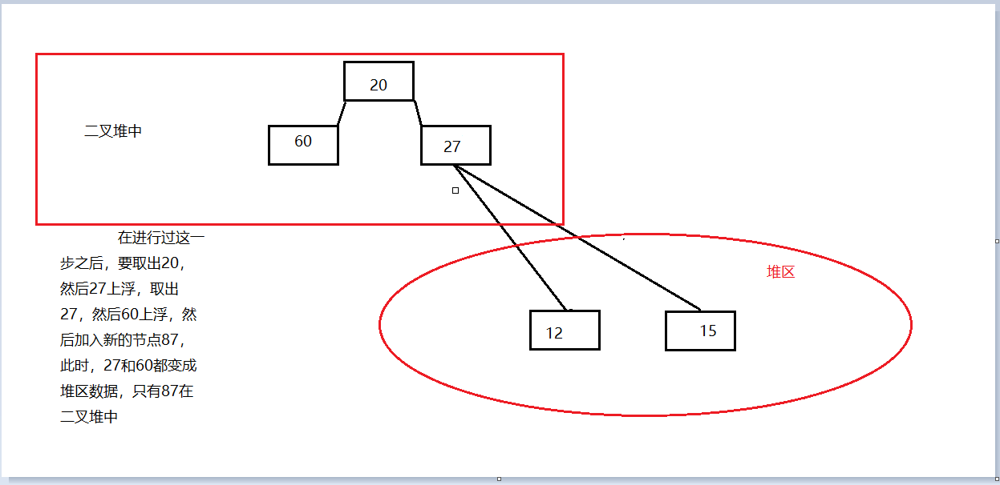
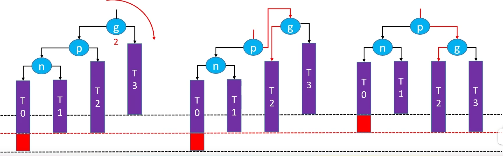
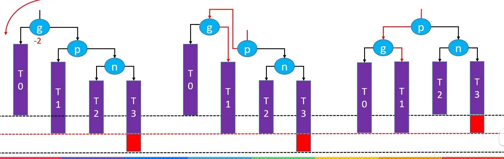
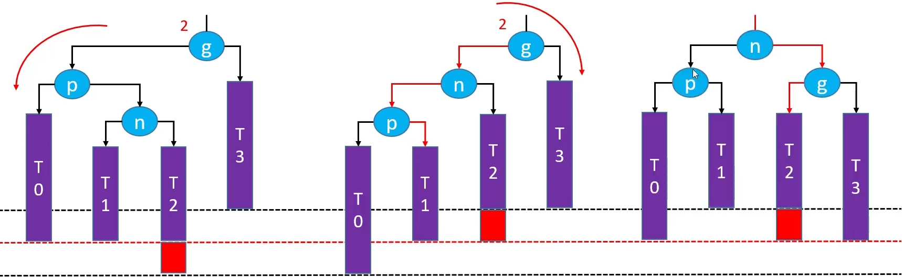
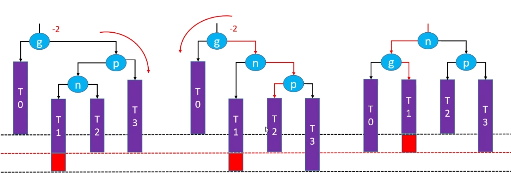

# 树和森林

## 定义

森林不同跟的树

1. 可以使用孩子兄弟表示法来储存

   另一棵树作为前一棵树根节点的子树

1. 树枝增加的个数为森林中树的个数 - 1

## 遍历

两种遍历方法

1. 先序遍历
   - 先访问根
   - 在访问子树的森林
   - 访问兄弟

1. 后序遍历

   原来森林的后序相当于二叉树化的中序

2. 其他

   - 森林中的叶子节点 == child 指针指向空

   - 求树高

     $h = max(child + 1 , brother)$

   - 求森林中父子对

     一个节点的所有子孩子是左子节点和左子节点的右子节点（循环至空）
   
   - 求森林中的所有叶子的个数
     
     若 firstson = nullptr num = 1 + num(nextbrother)
     
     若firstson!= nullptr num = num(firstson) + num(nextbrother)

# 二叉堆(Binary Heap)

## 定义

1. 堆是完全二叉树
2. 子树中所有子节点的值 > （或者 < ）父节点的值，左子节点值 <( > )右子节点的值

- 使用数组储存，可以充分利用空间上的优势和下标带来的便利性
- 根是堆中最大元素的堆称大顶堆，否则称小顶堆

## 建立

```c++
	void create_heap(vector<T>& v) {
		for (auto i : v)
			insert(i);
	}
//
```

## 插入

1. 将新的节点加入完全二叉树
2. 比较节点的值和父节点的值，按照规则判断是否交换(我们把这个操作称为上浮)
3. 重复上述过程，直到不能交换

```c++
void insert(T val) {
	heap[++size] = val;
	if (size == 0)
		return;
	sift_up(size);
}
```

## 删除

删除堆顶元素操作如下

1. 将堆顶元素和最后一个元素交换
2. 将堆底元素删除
3. 比较被交换元素和左子节点元素的值，判断是否交换（下沉）
4. 重复上述过程，直到不能交换

```c++
void pop() {
	if (size == 0)
		return;
	swap(heap[1], heap[size--]);
	sift_down(1);	
}
```

## 上浮和下沉

1. 上浮

   ```c++
   void sift_up( int index ) {
   	for (int i = index; i > 1 && !cmp(heap[ i ] , heap[i / 2]); i = i / 2) {
   		swap(heap[i], heap[i / 2]);
   	}
   }
   //cmp是自定义的比较器，小顶堆是heap[ i ] < heap[i / 2]
   //每次交换完之后将节点变为父节点，再和他的父节点比较
   ```

2. 下沉

   ```c++
   void sift_down(int index) {
   		for (int i = index , t = son(i); t <= size && cmp(heap[i],heap[ son(i) ]) ; i = t , t = son(i) ) {
   			swap(heap[i], heap[t]);
   		}
   	}
   int son(int i) {
   		return i * 2 + ( cmp( heap[2 * i] , heap[2 * i + 1] ) && 2 * i + 1 <= size);
   	}
   //下沉需要求儿子，大顶堆的儿子是，两个子节点中较大的那个 ， 小顶堆的儿子是，两个子节点中较小的那个 ， 小顶堆显然是更小的在上面，大顶堆显然是更大的在上面
   //同时保持都在size的范围之内
   //同时更新本身和自己的儿子
   ```

## 其他设计

```c++
#include<vector>
#include<functional>
using namespace std;
template<class T>
class Heap {
public:
	Heap(function<bool(T,T)> greater) :size(0) {
		cmp = greater;
	}
	Heap() :size(0) {
		cmp = [](T a, T  b) { return a > b; };
	}
	void insert(T val);
	void pop();
	T top() {
		return heap[1];
	}
    bool empty() {
		return size == 0;
	}
	int count() {
		return size;
	}
	void create_heap(vector<T>& v ,function<bool(T, T)> greater);
private:
	void sift_up( int index );
	void sift_down(int index);
	int son(int i);
	T heap[10000];
	int size;
	function<bool(T,T)> cmp;  //用来判断大小的函数
};
```

# 哈夫曼树(Huffman Tree)

## 定义

给定一组数$w_1,w_2,...w_n$作为叶子节点的权值构造一棵二叉树。如果$WPL = \displaystyle\sum_{i=1}^nw_iL_i $ 最小（其中$L_i$为$w_i$对应的叶子节点到根节点的路径长度），则称此二叉树为哈夫曼树(最优二叉树)，也称哈夫曼树并称$WPL$为带权路径长度

```c++
//节点类的声明
template<class T>
class Huffman_node {
public:	
	T val;  //值
	int weight;  //权值，出现的频率
	Huffman_node* lc;  //左指针
	Huffman_node* rc;  //右指针

	Huffman_node() :lc(nullptr), rc(nullptr), weight(0), val(0) {  }
	Huffman_node(int w) :lc(nullptr), rc(nullptr), weight(w) { this->val = 0; }
	Huffman_node(int w , T val) :lc(nullptr), rc(nullptr), val(val),weight(w) {}
	bool operator>(Huffman_node<T> node2) {  //两个节点大小的判断，通过比较权值
		return this->weight > node2.weight;
	}
};
```

## 部分接口和成员介绍

```c++
#include"Binary_Heap.hpp"  //二叉堆
#include"Tree_node.hpp" //节点
#include<fstream>
#include<unordered_map>
#include<string>
using namespace std;
template<class T>
class Huffman {
public:
	Huffman(string&path): root(nullptr) {  //初始化，使得文件被读入，节点的集合产生好
		read(path);
		generate_set();
	}
	void read(string& path); //读文件
	void write(string path); //写入编码后文件
	void expand(string path1, string path2); //解压缩

	void create_Huffman(vector<pair<int,T>>& v); //按照直接传入一个统计好权值的方式，便于测试
    
	void create_Huffman();  //创建哈夫曼树
	void Huffman_code();  //生成哈夫曼编码
	
private:
	string expand(string&target); //解压缩
	void generate_set(); //生成set
	void Huffman_code(Huffman_node<T>* h ,string code)//生成哈夫曼编码

	Huffman_node<T>* root;  //根
	unordered_map<T, string> code_sequence; //数据和编码的对应
	vector< Huffman_node<T> > set;  //一个集合，用来放节点
	string file; //要被处理的文件

};
```

## 构造哈夫曼树

1. W = $\{ w_i | i\in N_+ \}\;,\;T = \{ T_i | T_i = w_i \}\; T_i$只有根节点左右子树都是空的树
2. 从$T_i$中选出权值最小的两棵树,构成一颗权值为两树权值之和，左右子树为两棵子树的新树,将他并入树集,并将原来的两棵树从集合中删去
3. 重复此过程直到只剩下一棵树

在构造哈夫曼树的过程中，发现需要不停的取出一堆元素中的最小值，并且将两个较小的元素的和插入这一堆元素中，稍加思考，可以发现完美符合小顶堆的特性。

```c++
void create_Huffman() {
	Heap< Huffman_node<T> > h;  //建堆
	h.create_heap( set );  //将所有的节点放入这个堆中
	while (h.count() != 1) {
		Huffman_node<T>* node1 = new Huffman_node<T>(h.top());
		h.pop();  //取其中最大的元素
		Huffman_node<T>* node2 = new Huffman_node<T>(h.top());
		h.pop(); //第二次取其中最大的元素，即取第二大的元素
		Huffman_node <T> node3(node1->weight + node2->weight);  //新节点的插入
		node3.lc = node1;
		node3.rc = node2;
		//插入之后保持有序
		h.insert(node3);
	}
	root = new Huffman_node<T>(h.top());
	//有一个值得注意的地方，在存放节点时，放到二叉堆里的都是栈中的数据
	//在从二叉堆中取出之后，声明成为堆中的数据
}

//有时候测试直接传入权值和字符的关系
void create_Huffman(vector<pair<int,T>>& v) {
	for (auto i : v) {  //按照权重将节点
		Huffman_node<T> node(i.first , i.second);
		set.push_back(node);
	}
	create_Huffman();
}
```



## 哈夫曼编码

遍历哈夫曼树，只有叶子节点拥有哈夫曼的编码，通过根节点到达叶子节点的路径来确定哈夫曼编码

如：$lrllrr == 010011$ 即向左走是0向右走是1

```c++
//将所有生成的编码，放在一个哈希表中
void Huffman_code() {
	string code = "";
	Huffman_code(root, code);
	for (auto i : code_sequence) {
		cout << "原来的数据为" << i.first << endl;
		cout << "哈夫曼编码为" << i.second << endl;
	}
}
void Huffman_code(Huffman_node<T>* h ,string code) {
	if (h == nullptr) return;
	if (h->lc == nullptr && h->rc == nullptr) {
		code_sequence.insert(make_pair(h->val, code));
		return;
	}
	code += '0';
	Huffman_code(h->lc, code);
	code.pop_back();  //回溯！

	code += '1';
	Huffman_code(h->rc, code);
	code.pop_back(); //回溯！
}
```

## 编码还原

根据编码在树中依次向下找，直到找到叶子节点，之后重新从根节点向下找

```c++
string expand(string&target) {
	string res = "";
	int n = target.size();
	for (int i = 0; i < n; ++i) {
		Huffman_node<T>* branch = root;
		while (branch->lc != nullptr && branch->rc != nullptr) {
			if (target[i] == '0')  //编码0向左走
				branch = branch->lc;
			else if (target[i] == '1')  //编码1，向右走
				branch = branch->rc;
			i++;
		}
		--i;  //保持和上面for中的++平衡
		res += branch->val;
	}
    return res;
}
```

## 文件操作

文件操作包括

- 根据原文件将生成的编码写入新文件

  - 先读入源文件

    ```c++
    //读取源文件
    void read(string& path) {
    	//打开文件
    	ifstream ifs(path, ios::in);
    	//下面开始读字符串
    	string str;
    	while (!ifs.fail() && getline(ifs, str)) {
    		file += str;
    		file += '\n';
    	}
    	file.pop_back();  //多读一个回车，弹出
    	ifs.close();
    	//读文件成功
    }
    ```

  - 统计其中字符出现的频度，并放入集合中等待建树操作使用

    ```c++
    void generate_set() {
    	vector<int> weight(257, 0); //简易哈希，用来处理字符和权值的关系
    	for (auto i : file)
    		weight[i]++;  //遍历文件，权值增加
    	for (int i = 0; i < 257; ++i)
    		if (weight[i] != 0) {  //根据权值和字符的对应关系生成节点，放入集合，等待使用
    			Huffman_node<T> node(weight[i], i);
    			set.push_back(node);
    		}
    }
    ```

  - 建立一颗哈夫曼树

  - 生成哈夫曼编码，将编完的码储存在一个表中

  - 根据这个表将源文件转化为编码文件

    ```c++
    void write(string path) {
    	ofstream ofs(path ,ios::out);
    	for (auto i : file)
    		ofs << code_sequence[i]; //根据字符的对应关系将编码放入文件
        ofs.close();
    }
    ```

- 根据编码文件还原源文件

  ```c++
  void expand(string path1 , string path2) {
  	//读入
  	ifstream ifs(path1,ios::in);
      string target;
  	ifs >> target;
      ifs.close();
      //输出
  	ofstream ofs(path2, ios::out);
  	string res = expand(target);
  	for (auto i : res)
  		ofs << i;
  	ofs.close();
  }
  ```

# 二叉搜索树(Binary Search Tree)

## 需求分析

动态的数据中的搜索

1. 维护无序数组：添加$O(1)$,删除$O(n)$m,查找$O(n)$
2. 维护有序数组：添加$O(n)$,删除$O(n)$m,查找$O(log^n)$
3. 维护BST：添加$O(log^n)$,删除$O(log^n)$m,查找$O(log^n)$

## 定义

1. 是二叉树

2. 任意节点的值大于左子树所有值，小于右节点所有值

3. 左右子树也是二叉搜索树（**这是一个递归的定义方式**）

   ```c++
   class BST_node {
   public:
   	T val;
   
   	BST_node<T>* lc;
   	BST_node<T>* rc;
   	BST_node<T>* parent;  //父亲，便于实现求前驱后继或者删除的操作
   
   	BST_node() :lc(nullptr), rc(nullptr), parent(nullptr), val(0) {}
   	BST_node(T val) :lc(nullptr), rc(nullptr), parent(nullptr), val(val) {}
   	BST_node(T val, BST_node<T>*& parent) :lc(nullptr), rc(nullptr), parent(parent), val(val) {} //注意这里的引用
   };
   ```


## 加入元素

1. 新加入的元素一定是叶子

2. 如果没有节点，创建根节点

3. 和当前节点比较大小，如果大于当前节点，向右当前节点的指针向右下移动，否则向左下移动，重复该过程，直到，当前节点的指针指向空，如果等于当前节点的值，覆盖数据之后返回。

   ```c++
   void BST<T>::insert(T val) {
   	if (root == nullptr) {  //根为空,必须特殊处理
   		root = new BST_node<T>(val);
   		size++;
   		return;
   	}
   //添加的不是第一个节点
   //找val的父节点	
   	BST_node<T>* node = root;
   	BST_node<T>* parent = nullptr;
   	int cmp = 0;
   
   	while (node != nullptr) {
   		cmp = compare(val, node->val);
   		parent = node;
   		if (cmp > 0) 
   			node = node->rc;
   		else if (cmp < 0)
   			node = node->lc;
   		else {  //相等
   				/*
   				* 防止在使用对象的部分数据判定相等的情况下
   				* 其他部分数据不相等的情况
   				*/
   			node->val = val;
   			return;
   		}
   	}
   	//看看插入到父节点的哪个位置
   	node = new BST_node<T>(val, parent);
   	if (cmp > 0)
   		parent->rc = node;
   	parent->lc = node;
   	size++;
   }
   ```

## 查找元素

```c++
//查值 可以调用查找值所在的节点，设计其他函数时也可以用到
bool find(T val) {
	if (find_node(val) != nullptr) return 1;
	return 0;
}
//
template<class T>
BST_node<T>* BST<T>::find_node(T val) {
	BST_node<T>* node = root;  //从根节点开始寻找
	while (node != nullptr) {
		int cmp = compare(val, node->val);  //确定大小关系
		if (cmp > 0) //在右子树中找
			node = node->rc;
		else if(cmp < 0)  //在左子树中找
			node = node->lc;
		else  //找到了
			return node;
	}
	return node;//没找到,返回node,此时node为空 
}
```

## 删除元素

1. 删除度为0的元素：直接删除

2. 删除度为1的元素：删除该元素，如果他是父节点的右树，父节点的右指针指向他的子树，如果他是父节点的左树，父节点的左指针指向他的子树

3. 删除度为2的元素：删除该元素后，在他的左树中找到一个最大的，或者在右树中找到一个最小的来代替它（可以直接采用覆盖值的方式）

   - 被找到的元素只可能是度为0或者度为1的节点

   ```c++
   template<class T>
   void BST<T>::erase(T val) {
   	if (find_node(val) == nullptr) return;
   	else remove(find_node(val));
   }
   
   void BST<T>::change_pointer(BST_node<T>*& origin, BST_node<T>*& target, BST_node<T>*& deleted) {  //将一个指针指向一个新的地址，并将他原来指向的内存释放
   	origin = target;
   	delete deleted;
   }
   
   template<class T>
   void BST<T>::remove(BST_node<T>* node) {
   	if (node == nullptr) return ;
   	size--;
   	if (node->lc != nullptr && node->rc != nullptr) {  //节点是度为二的节点
   		BST_node<T>* s = inpre(node);				   //覆盖数据后转化为删除度为一或者0的节点
   		node->val = s->val;
   		node = s;
   	}
       
   	BST_node<T>* replacement = node->lc != nullptr ? node->lc : node->rc;  //求出代替被删除节点位置的节点
   
   	if (replacement != nullptr) {  // 度为1
   		replacement->parent = node->parent;
   		if (node->parent == nullptr) {  //被删者是根节点
   			delete node;
   			root = replacement;
   		}
   		else if (node->parent->lc == node)  //被删者不是根节点，是父节点的左孩子
   			change_pointer(node->parent->lc, replacement, node);
   		change_pointer(node->parent->rc, replacement, node);
   		return ;
   	}
   	else if (node->parent == nullptr) { //度为0 ，还是根
   		delete root;
   		root = nullptr;
   		return ;
   	}
   	//度为0 ，不是根
   	if (node == node->parent->lc)
   		change_pointer(node->parent->lc, replacement, node);
   	change_pointer(node->parent->rc, replacement, node);
   }
   ```

# 其他

1. 二叉搜索树中序遍历一定是升序
2. 层序遍历可以被用来计算二叉树的高度（如果你不想用递归）

# B（B+）树

# 红黑树

# AVL树

## 定义

某种情况下，二叉树搜索树的效率退化为链表

1. 平衡(Balance)：当节点的数目固定时，若左右子树的高度相差越小，称这棵树越平衡
2. 平衡因子(Balance Factor)：某个节点左右子树的高度差
   - 左子树的高度 - 右子树的高度 
   - 可能是负数
   - 叶的平衡因子为
3. AVL树所有节点平衡因子绝对值<=1，每个节点左右子树之差高度不超过1
4. AVL树是二叉搜索树

## 旋转

1. LL - 右旋转（单旋）

   当因为一个节点的左子节点的左子节点导致他失衡的时候（LL失衡），通过右旋转来平衡

   - 祖父左指向父的右
   - 父的右指向祖父
   - 父成为祖父
   - 旋转后依然是二叉搜索树
   - 高度恢复成没失衡之前的高度



2. RR - 左旋转（单旋）

   - 祖父右指向父左

   - 父左指向祖父

   - 父成为祖父



3. LR - 左旋转，右旋转（双旋）

   g的左节点的右节点导致他失去平衡

   - 对p进行左旋

   - 对g进行右旋



4. RL- 右旋转，左旋转（双旋）

   - 对p进行右旋

   - 对g进行左旋



