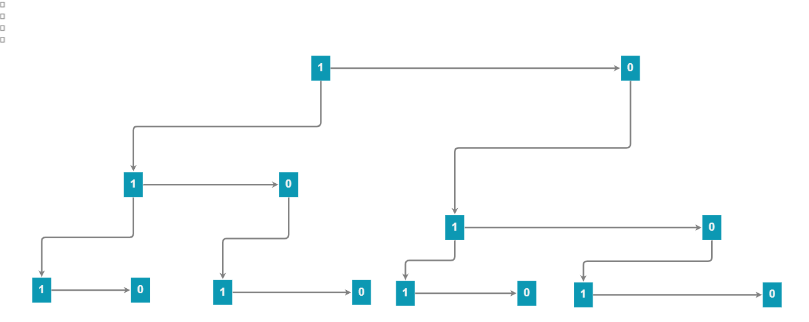

# 最原始的01背包问题

现在有n个物品，其重量为$w_1,...w_n$,背包重量为$S$在其中挑选m个使得$\sum w_i = S$

- 我们只需要枚举所有的重量就可以了，只需要考虑第$i$个物品选或者不选的所有情况就能完成枚举
  $$
  N(n) = 2\times N(n-1)\\
  n个物品中所有的选取情况N(n) = 这个物品选或者不选的两种情况2 \times n-1个物品选取的所有情况N(n-1)
  $$

- 我们可以继续抽象，枚举的所有的情况相当于这样
  $$
  S =C_n^0 + C_n^1 +....+C_n^n\\
  相当于求所有的物品中选取0件，1件....n件的所有情况
  $$

- 一共算了多少次？
  $$
  所有的情况一共有S =(1+1)^n种(二项式定理展开得到所有种数)
  $$

- 我们重复考虑的地方究竟在哪里

  比如说我们考虑前$i$个物品的选取，我们是从第一个物品开始考虑一直到第$i$个物品的情况

  

  

```c++
#include<iostream>
#include<vector>
#include<cstring>
using std::cin;
using std::cout;
using std::endl;
int S;
int numm;
int w[100]{};
int ans[100]{};
void dfs(int weight ,int num ,int k) //数量，下标
{
    if(num>numm || k>=numm) return; //当数量超过最大数量或者下标越界之后return
    if(weight + w[k] == S) //放入第i个物品刚刚好
    {
        ans[num] = k + 1; //放入这个物品，k是下标，不妨按序号储存答案
        for(int i = 1; i <= num; i++)
            cout<<ans[i]<<" ";
        cout<<endl;
    }
    else if(weight + w[k] < S)//放入第i个物品还是不够
    {
        ans[num] = k + 1; //先放进这个物品
        //说明要多放物品
        dfs(weight + w[k],num + 1, k + 1);
        //放入下一个物品，并且数量增加
    }
    dfs(weight,num,k+1); //不放第i个物品，从K+1开始放，这一个放超了S，不代表下一个能放超S
}
int main()//愉快的开始了主程序 
{
    cin>>S;
    cin>>numm;
    for(int i=0; i<numm; i++)
        cin>>w[i];
    dfs(0,1,0);
    system("pause");
    return 0;//愉快的结束了主程序 
}
```

# 幂集问题

$\{1，2...，n\}的所有子集称为其幂集，还是计算C_n^0+...+C_n^n 的所有可能的问题$

使用深搜的版本

```c++
#include<iostream>
#include<vector>
#include<algorithm>
using namespace std;
int n = 3;
vector<int> seq;
vector<vector<int>> ans;
void dfs(int i) {  //深搜模板1
	for (int j = i + 1; j <= n; ++j) { //从n+1开始搜
		seq.push_back(j);  //先加入序列
		dfs(j);  //深搜下个数
		ans.push_back(seq); //得到的序列加入答案
		seq.pop_back(); //回溯
	}
}
int main() {
	dfs(0);
	for (auto i : ans) {
		for (auto j : i) {
			cout << j <<" ";
		}
		cout << endl;
	}
}
```

实际上我们有如下地推关系$S_n = S_{n-1} + S_{n-1} \cup \{n\} $ 所以用循环来写是可能的

```c++
#include<iostream>
#include<vector>
#include<algorithm>
using namespace std;
vector<vector<int>> fn(int n) {
	vector<vector<int>> res(1,vector<int>(0));  //答案数组
	for (int i = 1; i <= n; ++i) {
		vector<vector<int>> vec(res);  //拷贝答案数组
		for (auto j : vec) {  //将每一个都放上新的元素
			j.push_back(i);
			res.push_back(j);  //将新得到序列加入答案数组
		}
	}
	return res;
}
int main()
{
	vector<vector<int>> res = fn(3);
	for (auto i : res) {
		for (auto j : i)
			cout << j << " ";
		cout << endl;
	}
}
```

# 回溯

- 全排列问题

  ```c++
  #include<iostream>
  #include<vector>
  using std::cin;
  using std::cout;
  using std::endl;
  int vis[6]{}; //初始化标记数组
  std::vector<int> seq; //初始化记录数组
  void dfs(int max , int deep)    //最大深度：用于判断递归边界    								 							//当前深度
  {
      for(int i = 1 ; i <= max ; i++)
      {
          if(!vis[i]) //如果没来过
          {
              vis[i] = true; //标记数字，说明来过
              seq.push_back(i); //加入到seq里面
              dfs( max , deep + 1); //深度增加
              vis[i] = false;  //回溯
              seq.pop_back(); //回溯，这里不光要回溯状态还要把数据取出来
          } 
      }
      if(deep == max) //最深层处说明达到条件，直接输出
      {					//最深处不一定要全部初始化，因为一个子树还没跑完，
          				//现在取出导致回溯完成的时候数据丢失
          				//初始化是在回归到0时才做的
          for(int j : seq)
              cout<<j<<" ";
          cout<<endl;
          return ;
      }
  }
  int main()
  {
     dfs(3,0);
  	system("pause");
  } 
  ```
  
- 八皇后问题

  ```c++
  #include<iostream>
  #include<vector>
  #include<random>
  using std::cin;
  using std::cout;
  using std::endl;
  int ans,ans1;
  int b[100]{},c[100]{},d[100]{},a[100]{}; //a储存答案，b储存列是否被占领，
  										//c储存对角线是否被占领
  										//d储存斜对角线是否被占领
  std::vector<int> seq; //初始化记录数组
  void dfs(int n , int i) 
  {
          for(int j = 1 ; j <= n; ++j)  //遍历
          if(b[j] == 0 && c[i-j+n] == 0 && d[ i + j] == 0)   //当这个点所在的列，对角线
              												//斜对角线都没被占领时
          {
              a[i] = j;  //标记来过
  
              b[j] = 1;   //占领列
              c[i-j+n] = 1;  //占领对角线
              d[i+j] = 1;   //占领斜对角线
              
              dfs( n , i + 1); //深度增加，走下一个子
              
              b[j] = 0;   //走完回溯
              c[i-j+n] = 0;
              d[i+j] = 0;
  
          } 
      if(i == n + 1)     //走到尽头，输出
      {
                for(int j = 1;j <= n;++j)
              cout<<a[j]<<" ";
          ans1++;
          cout<<endl;
          ans = 0;
      }
  }
  int main()
  {
     dfs(8,1);
     cout<<ans1;
  	system("pause");
  } 
  ```
  
- 二维平面

  

  ```C++
  #include<iostream>
  #include<vector>
  #include<random>
  using std::cin;
  using std::cout;
  using std::endl;
  int cnt;
  int sx,sy,ex,ey;
  int m,n;
  int dx[]{0,0,1,-1},dy[]{1,-1,0,0};
  int martix[1000][1000]{};
  void dfs(int x,int y)
  {
      for(int i = 0 ; i < 4 ; ++i) //考虑所有的四种走法
      {
          if(martix[x + dx[i] ][y + dy[i] ] == -1 || x > m || y > n || x < 1 || y < 1)
              continue;
          if(martix[x + dx[i] ][y + dy[i] ] == 0)
          {
              martix[x + dx[i] ][y + dy[i] ] = 1;
              dfs(x + dx[i], y + dy[i]);
              martix[x + dx[i] ][y + dy[i]] = 0;
          }
      }
      if(x==ex && y== ey) //到达终点
          cnt++;
  }
  int main()
  {
      
      cin>>n>>m; // 输入行和列
      int t;
      cin>>t;   //输入障碍物总数
      cin>>sx>>sy>>ex>>ey; // 输入起点和终点的坐标 
      for(int i = 0 ; i < t; ++i)
      {
          int tx,ty;
          cin>>tx>>ty;
          martix[tx][ty] = -1; //标记障碍物
      }
      martix[sx][sy] = 1; //忘记标记开始点来过了
     dfs(sx,sy);
     cout<<cnt;
  	system("pause");
  } 
  ```

- 滑雪

    

    ```c++
    #include<iostream>
    #include<vector>
    #include<random>
    using std::cin;
    using std::cout;
    using std::endl;
    int ans; //标记最长的长度
    int m,n; //
    int dx[]{0,0,1,-1},dy[]{1,-1,0,0};
    int martix[1000][1000]{};  //矩阵
    int D[1000][1000]; //将2维数组中最长的长度及记录下来
    int dfs(int x,int y)
    {
        if(D[x][y] != 0) return D[x][y]; //如果在之前的走法中已经走过了，直接返回最大路径的长度
        									//路径长度不是高度之差。。。，
        D[x][y] = 1;  //走到最后也算一步
        for(int i = 0 ; i < 4 ; ++i) //考虑所有的四种走法
        {
            if(martix[x + dx[i] ][y + dy[i] ] > martix[x][y]|| x + dx[i] > m 
            || y + dy[i] > n || x + dx[i] < 1 || y + dy[i] < 1)
                //越界，或者旁边的高度比该位置大，说明这个地方不能走
                continue;
            else
            {
                D[x][y] = std::max( dfs(x + dx[i], y + dy[i]) + 1 , D[x][y]); 
                //该路径长度最大值 = (走该点 + 走旁边的点的路径长度)  和   当前路径最长值  
            }
            //for循环中一共取四次，总有一次是最大的
            //另外，这题是动态规划，仔细思考，发现我们已经考虑了所有的情况，满足无后效性的原则
        }
        return D[x][y];
    }
    int main()
    {
        
        cin>>m>>n; // 输入行和列
        for(int i = 1 ; i <= m ; ++i)
        {
            for(int j = 1 ; j <= n ; ++j)
            {
                int high;
                cin>>high;
                martix[i][j] = high;
            }
        }
        for(int i = 1 ; i <= m ; ++i)
            for(int  j = 1 ; j <= m ; ++j)
                ans = std::max(ans,dfs(i,j));
        cout<<ans;
    	system("pause");
    } 
    ```


- 可放回的排序

  

  ```c++
  #include<iostream>
  #include<vector>
  #include<cstdio>
  using std::cin;
  using std::cout;
  using std::endl;
  int ans;
  int n,k;
  void dfs(long long num, int deep)  //当前数字，递归深度
  {
      if(deep == n ) //当递归深度=n时，一定要返回
      {
          if(num%k==0) //当符合条件时才++
              ans++;
          return ;
      }
      for(int i = 1; i<= 6 ;++i)
      {
          dfs( num*10+i ,deep + 1);  //继续递归
      }
  }
  
  int main()
  {
      cin>>n>>k;
      for(int i = 1; i <= 6 ; ++ i)
      {
          dfs(i,1);
      }
      cout<< (ans) % int(1e9+7);
  	system("pause");
  } 
  ```

- 图的遍历

  ```c++
  #include<iostream>
  #include<vector>
  #include<cstdio>
  using std::cin;
  using std::cout;
  using std::endl;
  const int maxn = 1e5;
  int max,n;
  int ans[maxn]{}; //记录答案
  std::vector<int> G[maxn]{};
  int cnt;
  void dfs(int x , int max)
  {
      if(cnt == n  || ans[x] != 0) return; //所有的点都遍历完称或者之前遍历过，直接返回
      if(ans[x] == 0 ) //没遍历过，直接以最大值覆盖
      {
          ans[x] = max;
          cnt++;
      }
  
      for(int i = 0; i < G[x].size(); ++i)
      {
          dfs(G[x][i] , max);  //遍历相邻点
      }
  
  }
  
  int main()
  {
      int k;
      cin>>n>>k;//输入顶点数和边数
      for(int i = 0; i < k; ++i)
      {
          int from,to;
          cin>>from>>to;
          G[to].push_back(from);
          //反向建边
      }
      for(int i = n ; i > 0 ; --i)
          dfs(i,i);
      for(int i = 1; i <= n; ++i)
          cout<<ans[i]<<" ";
  	system("pause");
  } 
  ```

- 马的遍历

  

  ```c++
  #include<iostream>
  #include<vector>
  #include<cstdio>
  using std::cin;
  using std::cout;
  using std::endl;
  int n , m;
  int sx,sy;
  int dx[]{2,-2,2,-2,1,1,-1,-1};
  int dy[]{1,1,-1,-1,2,-2,2,-2};
  int martix[1000][1000]{};
  void dfs(int x, int y,int step)
  {
      if(step > 400) return; //剪枝，要不然一个点会过不了
      martix[x][y] = step; //不要忘记填值
  
      for(int i = 0; i < 8 ; ++i)
      {
          int xx = x + dx[i];
          int yy = y + dy[i];
  
          if(xx > 0 && yy > 0 && xx <= n && yy <= m) //坐标符合条件
          {
              if(martix[xx][yy] > step + 1 || martix[xx][yy] == -1) //没填过或者原来的数字太大
                  dfs(xx , yy , step + 1);
          }
  
      }
  }
  
  int main()
  {
      cin>>n>>m;
        for (int i = 1; i <= n; i++)
          for(int j = 1 ; j <= m ; j++)
              martix[i][j] = -1;
      
      cin>>sx>>sy;
      dfs(sx,sy,0);
    
      for (int i = 1; i <= n; i++)
      {
          for(int j = 1 ; j <= m ; j++)
              printf("%-5d",martix[i][j]);
          cout<<endl;
      }
      
  	system("pause");
  } 
  ```


# [LeetCode P131 分割回文子串](https://leetcode-cn.com/problems/palindrome-partitioning/)

```c++
class Solution {
public:
    vector<string> path;
    vector<vector<string>> res;
    int n;
    void dfs(string & str,int deep){
        if(deep == n){  //如果枚举到最后一个位置，那么就加入答案
            res.push_back(path);
            return;
        }
        for(int j = deep ; j < str.size() ; ++j){
            if(ispatition(str.substr(deep,j - deep + 1)) == 1){  //如果是回文串，加入path
                path.push_back(str.substr(deep,j - deep +1));
            }else continue; //否则跳过这一层
            dfs(str,j+1);  //枚举从下一个字母开始的所有子串
            path.pop_back();  //回溯，枚举下一个分割
        }
    }
    bool ispatition(const string & s){  //是否是回文串
        int i = 0 , j = s.size() - 1 ;
        while(i<=j){
            if(s[i] != s[j]) return false;
            i++;
            j--;
        }
        return true;
    }
    vector<vector<string>> partition(string s) {
        n = s.size();
        dfs(s,0);
        return res;
    }
};
```

